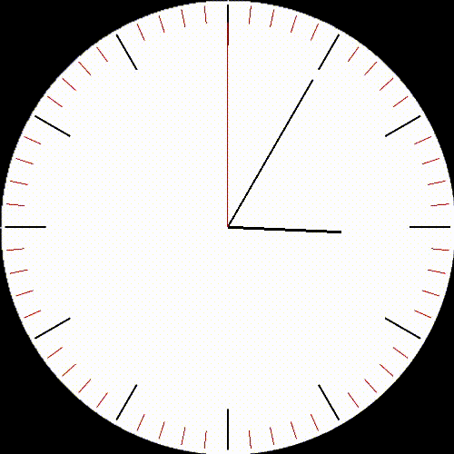
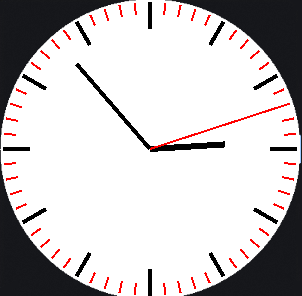
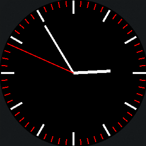

# AnalogClock
<div align="center">    
A simple analog clock built using C and SDL2 library. The clock displays the current time with hour, minute, and second hand.   
You can use it as a desktop widget or a terminal application to check the time in a visually appealing way.       
<br><br>


<!-- Add a video demonstration of the clock in action -->

</div>

## Compilation and Execution
To compile and run the AnalogClock program, follow these steps:
1. Ensure you have the SDL2 library installed on your system.
2. Clone the repository or download the source code.
``` bash
git clone https://github.com/MertYksl03/AnalogClock.git
```
3. Navigate to the directory containing the source code.
```
cd AnalogClock
```
4. Compile the program using the following command:
```bash
make build
```
5. After successful compilation, run the program with:
```bash
./AnalogClock 
```
## Usage 
- You can change the clock's size with the `-s` option followed by the desired size in pixels. For example:
```bash
./AnalogClock -s 400
```
- You can switch between the clock's color theme with the `-l` or `-d` options for light and dark themes, respectively. For example:
```bash 
./AnalogClock -l
```
- To display the current time in the terminal, use the `-t` option:
```bash
./AnalogClock -t
```

- To run the clock in the background as a daemon, use the `-b` option:
```bash
./AnalogClock -b
```

- For help and more options, use the `-h` option:
```bash
./AnalogClock -h
```
## Screenshots 
<div align="center">
     
</div>

